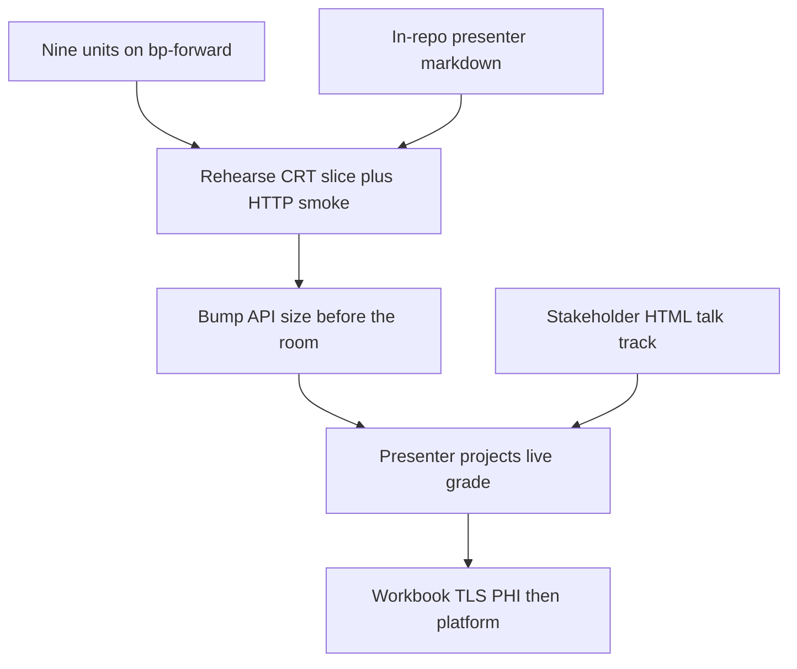

# Post-Backlog Look-Forward - Plan

## Goal Capsule

- **Objective:** Write two look-forward pages that share one true / not / next table for a projected CRT-slice showcase after the nine explainer follow-ons land on `bp-forward`.
- **Product authority:** This plan owns those two pages: the stakeholder HTML sequel and the in-repo presenter markdown.
- Surrounding platform work (capacity bump, TLS cert, labeled workbook, Salesforce, other environments, ideas 9–11) is not active scope.
- **Open blockers:** None for writing the docs.

---

## Product Contract

### Summary

After the nine explainer follow-ons land in `dev`, publish a stakeholder talk track and a presenter runbook that share one true / not / next table.
The room watches a presenter-projected live CRT slice on the internal network; attendees never hit the API.
The pages tell the honest next (workbook, certificate, then platform work) and do not claim HTTPS, Salesforce, all four environments, or an agreement percentage without a labeled workbook.

### Problem Frame

The August explainer mapped a prototype to a checklist-filler behind Salesforce CRT and listed the gaps that stood in the way.
The nine child specs close those near-term product gaps in `dev`.
A room that still reads the August page will think the batch API, auth, scoping, hybrid search, eval, ingestion, and verdict store are unbuilt.
A room that hears only "the gaps are closed" will infer Salesforce-ready, HTTPS-ready, or four-environment runtime.
Neither reading is true, and there is no labeled CRT workbook in git from which to quote an agreement rate.

### Actors

- A1. Stakeholder in the room: watches a projected live grade; never calls the API.
- A2. Presenter: on VPN or the CMS network, grades a real CRT export slice and walks the shared table.
- A3. Engineer: rehearses the presenter path, runs HTTP smoke, recommends a capacity bump, and owns the abort plan.

### Requirements

**HTML voice**

- R1. The HTML is a timed talk track for the room, not a status dump or a gap-by-gap delta of the August explainer.
- R2. Attendees never hit the API; A2 projects the live grade.
- R3. The HTML reuses the August explainer's CSS, voice, and honesty, and does not edit that file.
- R4. The talk track runs this sequence: what it is; what changed in `dev`; watch a real CRT slice of dozens of rows; what that proved (checklist-filler, not a chatbot); honest missing; what to sponsor next; then the compact table from R5.

**Shared table**

- R5. The HTML and the markdown copy the same true / not / next table below, with no extra rows.

True now (once all nine child specs are `done` on `bp-forward`, in `dev`):

- Batch grade of requirements (explainer gap 1 / idea 2)
- API key on non-health routes (gap 2 / idea 7 partial)
- Per-request contract scoping (gap 4 / idea 3)
- Hybrid search, rerank, and query-embedding fix (gap 5 / idea 1 / defect 1)
- Offline eval harness exists; live eval is opt-in (gap 7 / idea 5) — numbers need a labeled CRT workbook
- Verdict persistence available in `dev` (idea 8)
- Recursive chunking (defect 5); pandas pin (defect 2)
- Event-driven ingestion exists; dev deploy currently arms it
- ALB idle timeout 300s; API still internal-only HTTP unless a cert ARN is filled

Not true yet:

- TLS in transit (cert ARN map is empty)
- qa / uat / prod actually running the app (explainer idea 4 / gap 6; program out of scope)
- Salesforce CRT filling reviewer fields (OY2-40312)
- ATO and Datadog epics
- Measured human agreement (workbook is a human input, not in git)
- A browser UI, so no Playwright e2e
- Python tests in CI (locked unless explicitly approved)
- Explainer ideas 9–11 (compare, amendment diff, confidence routing)
- PHI/PII determination for verdicts outside `dev`

Next, in this order:

1. Pre-showcase prove: HTTP smoke + a CRT-slice rehearsal on the same path the presenter will use
2. Capacity bump before the room
3. Showcase: presenter on VPN/CMS network projects a live CRT slice
4. Labeled CRT workbook if the room should hear agreement numbers
5. ACM cert + DNS so TLS can actually turn on
6. PHI determination before enabling verdict store outside `dev`
7. Then, separately: qa activation, Salesforce, ATO/Datadog, ideas 9–11

**Engineering answers**

- R6. The markdown, not the HTML, answers how the nine units are known to work, what "e2e" means here, the capacity recommendation, and directional future work.
- R7. Pre-showcase prove is a rehearsal of A2's path: real API key, indexed contract, CRT slice, on the internal network.
- R8. "E2E" in the markdown is HTTP smoke against the live internal API (health with no key, then authenticated `/contracts` and `POST /requirements`, then the CRT slice), not a browser suite.
- R9. The markdown recommends bumping the `dev` API to at least the existing uat/prod size (512 CPU / 1024 MiB) before the room, and does not implement that bump.

**Overclaim**

- R10. Neither public artifact says HTTPS-ready, Salesforce-ready, or all four environments, and neither quotes an agreement percentage unless a labeled CRT workbook exists.

### Key Decisions

- **External stakeholders over internal-only.** (session-settled: user-directed — chosen over internal-only: the room needs a talk track they can follow without calling the API.) Governs R1, R2, R4.
- **Mechanism then honest-next over accuracy-first.** (session-settled: user-directed — chosen over accuracy-first: there is no labeled workbook, so the room watches the grading mechanism and hears what is still missing.) Governs R4, R10.
- **HTML plus in-repo markdown over one artifact or editing the explainer.** (session-settled: user-directed — chosen over a single page or editing the August explainer: the room and the presenter need different depths; the original explainer stays the map.) Governs R3, R6.
- **Presenter-projected live CRT slice over a recording or opening the API.** (session-settled: user-directed — chosen over a recording or attendee API access: attendees never hit the API.) Governs R2, R7.
- **Showcase talk track plus shared table over a gap-delta sequel.** (session-settled: user-directed — chosen over a gap-by-gap delta page: the room hears a narrative, then one true / not / next table.) Governs R1, R5.

### Key Flows

- F1. Stakeholder talk track
  - **Trigger:** A2 opens the HTML in the room.
  - **Actors:** A1, A2
  - **Steps:** Walk R4's sequence; project the live CRT slice during the watch beat; close on the R5 table.
  - **Outcome:** A1 can say what the tool is, what changed in `dev`, what is still missing, and what to sponsor next.
  - **Covered by:** R1, R2, R4, R5, R10

- F2. Pre-showcase prove
  - **Trigger:** A3 prepares the room path before F1.
  - **Actors:** A2, A3
  - **Steps:** HTTP smoke per R8; CRT-slice rehearsal on the same path A2 will use; confirm the `dev` API size meets R9 or abort the live batch.
  - **Outcome:** The watch beat in F1 is a known path, not a first attempt.
  - **Covered by:** R6, R7, R8, R9

### Acceptance Examples

- AE1. No labeled workbook
  - **Covers R10, R5.**
  - **Given:** No labeled CRT workbook is in git.
  - **When:** Either public artifact is read or spoken in the room.
  - **Then:** No agreement percentage appears.

- AE2. No TLS cert
  - **Covers R5, R10.**
  - **Given:** The ACM cert ARN map is empty.
  - **When:** Either public artifact describes transport.
  - **Then:** The API is internal-only HTTP, not HTTPS-ready.

- AE3. Capacity before the room
  - **Covers R9.**
  - **Given:** The `dev` API is still 256 CPU / 512 MiB.
  - **When:** A2 is about to project a dozens-row CRT slice.
  - **Then:** The markdown treats a bump to at least 512 CPU / 1024 MiB as a pre-showcase condition, and this work does not change CDK.

- AE4. No Playwright
  - **Covers R8.**
  - **Given:** There is no browser UI.
  - **When:** The markdown defines e2e.
  - **Then:** E2E is HTTP smoke plus the CRT-slice rehearsal, not Playwright.

### Scope Boundaries

- This work writes the two pages named in Goal Capsule and this Product Contract.
- It does not edit application, CDK, workflow, or CI code.
- It does not edit the August explainer.
- It does not implement the capacity bump, fill a cert ARN, add Python CI, activate qa/uat/prod, connect Salesforce, or build ideas 9–11.

### Dependencies / Assumptions

- The nine child specs under `.cursor/harness/specs/aisuite-explainer-backlog.md` are `done` on `bp-forward` before the R5 "true now" column is spoken as present tense in `dev`.
- A2 can reach the internal ALB (VPN or CMS network).
- A CRT export slice exists for the watch beat, even if it is unlabeled.
- A labeled workbook is a human input, not something this repo invents.
- An ACM cert ARN and DNS name are program-controlled and not inventable here.

<!-- ce-section: work-relationships -->
### How This Work Fits Together

This plan owns the two look-forward pages that sit after the nine explainer follow-ons.
The broader breakdown below is the current understanding, not a committed roadmap.

- Depends on the nine child specs listed in `.cursor/harness/specs/aisuite-explainer-backlog.md` for every "true now" row in R5.
  - Shares the product story with the August explainer (external sibling `aisuite-explainer.html`); this work does not replace or edit it.
  - Enables F1 in the room once F2 has been run.
- Can proceed independently of Salesforce CRT (OY2-40312), ATO, Datadog, qa/uat/prod activation, and explainer ideas 9–11.
- Still to decide, as human inputs rather than this plan's requirements: labeled CRT workbook, ACM cert + DNS, and PHI/PII determination for verdicts outside `dev`.

### Sources / Research

- `.cursor/harness/specs/aisuite-explainer-backlog.md` — parent of the nine follow-ons this look-forward assumes landed.
- August explainer (external sibling `aisuite-explainer.html`) — product lede, gap/idea numbers cited in R5, and the CSS/voice the HTML must reuse.
- `src/constructs/compute-construct.ts` — `dev` API size 256 CPU / 512 MiB; uat/prod 512 CPU / 1024 MiB; ALB idle timeout 300s; HTTPS only when `apiCertificateArn` is set.
- `src/deployment-config.ts` — `DEPLOYMENT_ENVIRONMENT_API_CERTIFICATE_ARN` is empty.
- `src/constructs/batch-construct.ts` — batch tasks already 1 vCPU / 2 GiB.
- `.github/workflows/deploy.yml` — `dev` deploy passes `aisuite:activateIngestion=true`.
- `services/rag/README.md` and `services/rag/eval/README.md` — HTTP surfaces, API key secret, Excel CRT client, opt-in live eval via `AISUITE_EVAL_LIVE=1`.
