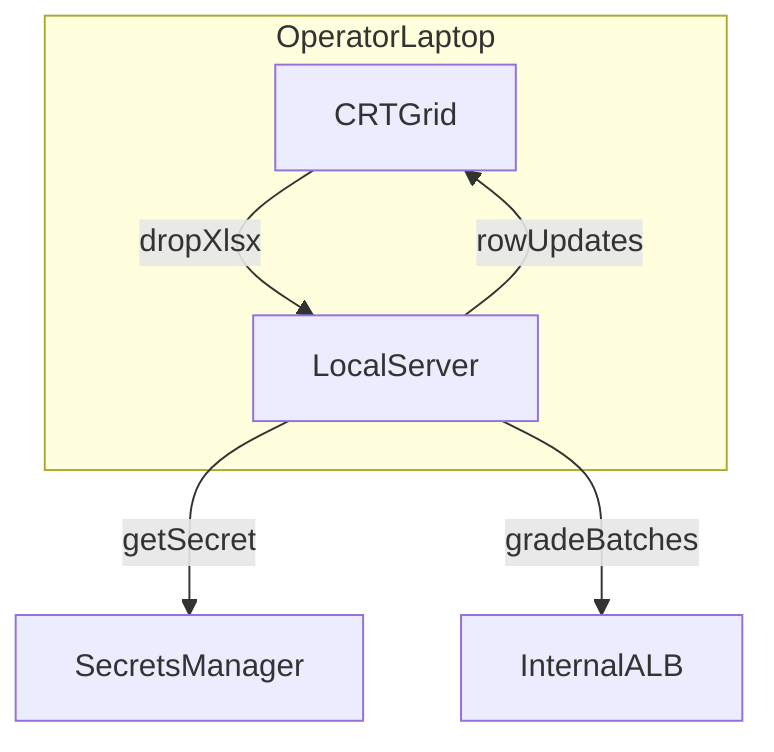

# CRT Operator Grid - Plan

## Goal Capsule

- **Objective:** Give operators on VPN a lasting CRT grid: drop a real export, see Recommendation / Response / Source / Page fill against the already-indexed contract.
- **Product authority:** This plan owns that local operator surface. The look-forward pages, Salesforce CRT, TLS, other environments, and a hosted ALB UI are not active scope.
- **Open blockers:** None for writing this artifact.

---

## Product Contract

### Summary

A lasting operator CRT grid on the operator laptop.
On VPN, drop a real CRT export; a small local server uses the operator's AWS login to fetch the API key from Secrets Manager; Recommendation, Response, Source, and Page fill in against the already-indexed contract.
It stays after the room as the way operators grade slices.

### Problem Frame

The live path today is curl plus an Excel client that writes an output workbook after the run.
That does not look like a checklist filling in, and the Excel client never writes Page even though the API returns it.
A chat box is the wrong demo.
A static webpage cannot fetch AWS secrets without putting account credentials in the browser.

### Actors

- A1. Operator (presenter in the room, then ongoing): VPN or CMS network, AWS account access, CRT export on disk. Projects the grid. Attendees never call the API.
- A2. Stakeholder in the room: watches the projected grade; never receives URL or key.

### Requirements

**Surface**

- R1. The operator surface is a CRT-like grid served from a small server on the operator laptop, and it remains after the showcase as the way operators grade slices.
- R2. Attendees never receive the grid URL or the API key; A1 projects.

**Slice**

- R3. A1 drops a real CRT `.xlsx`. Parsing uses the same header layout as the Excel client: header row index 10, `Requirement` column, data from row 11.
- R4. The slice is dozens of rows, not a toy question typed into a chat box.

**Grading**

- R5. Rows grade against the already-indexed contract (default when `contract_id` is omitted).
- R6. As each batch returns, the grid fills Recommendation, Response, Source, and Page from the API (the Excel client today writes Recommendation, RAG Response, and Source only).
- R7. If a batch fails or hangs past the API idle ceiling (300s), filling stops and the failure is visible. Do not silently start a larger slice.

**Secrets**

- R8. A small server behind the grid fetches the API key from AWS Secrets Manager `aisuite/dev/rag-api-key` (JSON field `apiKey`) using A1's AWS credentials. The key is never rendered.

**Lock**

- R9. This work lifts the no-browser-app lock for this operator surface only. Playwright stays off.

### Key Decisions

- **Lasting operator UI over a delete-after-room prop or Excel-as-the-engine.** (session-settled: user-directed — chosen over a showcase-only booth and an Excel watch window: keep using it after the room.) Governs R1.
- **Local laptop server over a hosted page on the load balancer.** Lasting plus laptop AWS creds means each operator runs it locally. Governs R1, R8.
- **Real CRT workbook drop over paste/CSV.** (session-settled: user-directed — chosen over paste/CSV or a baked-in file: same workbook reviewers already have.) Governs R3, R4.
- **Small server fetches AWS secrets over typing or rendering a key.** (session-settled: user-directed — chosen over a static page or typing the key on the projector: attendees never see the secret.) Governs R8, R2.
- **Show Page from the API even though the Excel client does not write a Page column.** Governs R6.
- **Playwright stays off.** Governs R9.

### Key Flows

- F1. Operator grades a CRT slice
  - **Trigger:** A1 is on VPN with AWS access and a CRT export.
  - **Actors:** A1
  - **Steps:** Open the local grid; drop the `.xlsx`; server fetches the key; post batches to the internal API; grid fills per R6; abort per R7 if a batch dies.
  - **Outcome:** A1 sees Recommendation, Response, Source, and Page against the indexed contract.
  - **Covered by:** R1, R3, R4, R5, R6, R7, R8

- F2. Room watch beat
  - **Trigger:** A1 projects F1.
  - **Actors:** A1, A2
  - **Steps:** A1 shares the grid after the key is in the server, not on screen. A2 watches rows fill. A2 never gets URL or key.
  - **Outcome:** The room sees checklist-filler behavior, not a chatbot.
  - **Covered by:** R2, R4, R6

### Acceptance Examples

- AE1. Page is visible
  - **Covers R6.**
  - **Given:** The API returns Page and the Excel client does not write a Page column.
  - **When:** A batch returns.
  - **Then:** The grid shows Page for those rows.

- AE2. Key stays off the projector
  - **Covers R2, R8.**
  - **Given:** A1 has AWS access.
  - **When:** The grid is projected.
  - **Then:** The API key is not visible on screen.

- AE3. Not a chat box
  - **Covers R3, R4.**
  - **Given:** A real CRT export with dozens of requirement rows.
  - **When:** A1 drops the file.
  - **Then:** Those rows are the ones graded, not a typed chat question.

- AE4. Batch death is obvious
  - **Covers R7.**
  - **Given:** The first batch errors or hangs past 300s.
  - **When:** Filling is in progress.
  - **Then:** The grid stops and shows the failure; it does not start a larger slice.

### Scope Boundaries

- This is not a hosted page on the internal ALB.
- Not Salesforce CRT (OY2-40312).
- Not TLS, qa/uat/prod runtime, Playwright, or chat-box grading as the demo path.
- Does not implement the look-forward capacity bump (512 CPU / 1024 MiB). That remains a pre-showcase condition if dozens of rows are too slow on current `dev` size.
- Does not mutate the input workbook.

### Dependencies / Assumptions

- The batch API, API key, and an indexed contract are live in `dev` (look-forward "true now" once the nine follow-ons are `done`).
- A1 can reach the internal ALB (VPN or CMS network) and has AWS access to Secrets Manager.
- A CRT export exists on disk. Unlabeled is enough for the mechanism; a labeled workbook is still required before anyone quotes an agreement rate.
- Default indexed contract is `tn_6756` unless A1 is grading a different already-indexed contract.
- The key lives in Secrets Manager, not SSM Parameter Store.

### Outstanding Questions

- Deferred to Planning: how the local server is packaged and launched.
- Deferred to Planning: whether an output `.xlsx` is also written (the grid is the required record).
- Deferred to Planning: a contract picker if A1 must grade a non-default indexed contract in the same sitting.

<!-- ce-section: work-relationships -->
### How This Work Fits Together

This plan owns the lasting local CRT operator grid.

- Depends on the nine explainer follow-ons and the live `POST /requirements` path described in [docs/post-backlog-look-forward.md](docs/post-backlog-look-forward.md).
  - Shares CRT header layout with `services/rag/search/excel_process/`.
  - Enables the look-forward showcase watch beat without making Excel-after-the-run the projected artifact.
- Can proceed independently of Salesforce CRT, TLS, qa/uat/prod, and explainer ideas 9–11.
- Supersedes [`.cursor/harness/specs/browser-ui-playwright.md`](.cursor/harness/specs/browser-ui-playwright.md) for this operator surface only; Playwright remains locked.
- Still to decide outside this plan: capacity bump before the room, labeled CRT workbook, ACM cert + DNS.

### Sources / Research

- [docs/post-backlog-look-forward.md](docs/post-backlog-look-forward.md) and [docs/plans/2026-08-12-001-docs-post-backlog-look-forward-plan.md](docs/plans/2026-08-12-001-docs-post-backlog-look-forward-plan.md)
- `services/rag/search/excel_process/crt_layout.py` and `process_excel_with_rag.py` — header layout; no Page column; no `contract_id`
- `services/rag/search/routes/endpoint.py` — `POST /requirements` returns Recommendation, Response, Source, Page; batch cap 25
- `src/constructs/secrets-construct.ts` — Secrets Manager `aisuite/{environment}/rag-api-key`
- `.cursor/harness/specs/browser-ui-playwright.md` — no-browser-app lock until this product decision
