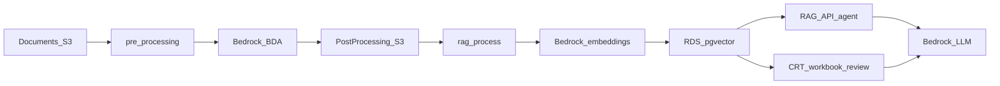

# AISuite RAG service

Application code for the CMCS Agentic RAG pipeline (Phase 2 packaging).

## Architecture

### Cloud layout

Each environment deploys an internal ALB and ECS Fargate RAG API, on-demand ECS
batch tasks (pre-processing, RAG process, DB bootstrap), and private RDS
Postgres with pgvector. S3, Secrets Manager, ECR, and Bedrock sit outside the
VPC but in the same account/region.


*Alt text: AWS reference architecture for AISuite Phase 2 VPC, ECS, RDS, S3, and Bedrock.*

Open or edit the diagram in [diagrams.net](https://app.diagrams.net/) by loading
`docs/aisuite-phase2-architecture.drawio.png` (PNG with embedded draw.io XML).
See also the [repo root README](../../README.md#architecture).

### Pipeline data-flow



1. **Pre-processing** lists source docs under the active contract’s S3 prefix,
   runs Bedrock Data Automation, and writes parsed text/table/image outputs to
   the post-processing bucket.
2. **RAG process** loads those outputs, chunks text, writes split JSON, embeds
   with Bedrock, and stores vectors in the active contract’s embeddings table.
3. **API** answers natural-language questions via search over that table and a
   Bedrock foundation model.
4. **Contract review** runs the requirements in a CMS Contract Review Tool
   workbook through the same retrieval and writes the findings back into the
   workbook.

### Retrieval

`search/database_searching/search.py` offers four strategies over the active
contract’s embeddings table:

| Method | What it does |
|--------|--------------|
| `semantic_search` | Cosine nearest neighbours via the pgvector HNSW index |
| `fulltext_search` | Postgres full-text search over the generated `search_tsv` column |
| `hybrid_search` | Both of the above in one round trip, fused with reciprocal rank fusion |
| `reranked_search` | `hybrid_search` for recall, then Cohere rerank for precision — available but not wired into the agents |

Hybrid is what the agents call, for both contract review and the query API.
Vector search alone misses exact contract vocabulary (statute cites, defined
terms, “shall not”); full-text alone misses paraphrased requirements. RRF needs
no score normalisation between the two, which matters because `ts_rank_cd` and
cosine distance are not on comparable scales.

Every row carries a **retrieval confidence**, which is the cosine similarity
(`1 - distance` from pgvector’s `<=>`) clamped to 0–1. `hybrid_search` scores the
lexical arm against the query vector too, so a chunk that only full-text found
still reports a confidence instead of a blank. The number is never shown to a
model — a model told a chunk scored 0.47 hands that back as its own confidence,
which would leave the two confidence columns in the workbook saying the same
thing twice.

### Retrieval policy

`search_contract` only retrieves. What an agent is *allowed* to retrieve lives in
`review_hooks`, a pydantic-ai `Hooks` capability in
`search/database_searching/agents.py` that both searching agents register, so a
limit only has to be right in one place.

| Hook | Policy |
|------|--------|
| `charge_search_budget` (`before_tool_execute`) | `MAX_SEARCHES` per requirement, then `ToolFailed`. A model that keeps searching instead of committing to a status is told to decide on what it has. Charged before the search runs, so a backend failure costs a search rather than letting the same error be retried forever. |
| `retry_failed_search` (`tool_execute_error`) | A psycopg or boto error becomes `ModelRetry("try a shorter query")`. The raw exception is logged, not handed to the model, which can do nothing with it. |

`ToolFailed` rather than returning a string that says the budget is gone: the call
did not happen, so recording it as a successful tool result misleads both the
model and the trace. The model still sees the reason and adapts, and it costs
nothing from the retry budget.

### Model resilience

`bedrock_hooks` in `search/database_searching/model_provider.py` is a second
capability, registered on **all four** agents — the analyst and the question agent
alongside `review_hooks`, and the challenger and adjudicator, which have no tools
and so need nothing else.

Its one hook, `retry_model_error` (`wrap_model_request`), re-sends a request that
came back as Bedrock's 424 `ModelErrorException` — up to `MODEL_ATTEMPTS` (3) with
a linear backoff. Nova Pro answers a tool-use turn with a malformed block often
enough to matter: three requirements out of 667 died on *"Model produced invalid
sequence as part of ToolUse"* in a full CRT run, each one a row a reviewer then has
to do by hand. botocore does not retry a 4xx, reasonably — but this particular one
is not the caller's fault, and the request that failed was fine, so the retry sends
it again unchanged.

Only that status is retried. A 400, an access denial, or an expired token would
fail identically three times over, and the run is better off surfacing it at once.
Throttling is already handled by botocore on the shared `bedrock-runtime` client.
Nothing changes on the normal path — a request that succeeds is not retried, so
the hook costs a run nothing until something breaks. Whatever still fails after
three attempts lands in `RequirementReview.error` and the Error column as before.

### What gets embedded

`data_preprocessing/parsing/parsed_text_data.py` drops text that would compete
with real provisions at retrieval time:

| Filter | Why |
|--------|-----|
| `SKIP_SUBTYPES` — `PAGE_NUMBER`, `FOOTER`, `HEADER` | A running footer embeds like any other chunk. This contract had 201 identical `RFP Boilerplate I 07012019` footers and 199 page numbers. |
| `MIN_CONTENT_CHARS` | Empty list scaffolding (`- \n- \n-`), a stray `[X]`, a bare `## J.` — nothing anyone could retrieve. |

Section headers are kept: they are how a requirement about a named section gets
found. Printed table-of-contents pages are **not** filtered out, so a query can
come back with a contents row — a section title against a page label — instead of
the provision it was asking about. The analyst prompt tells the model not to cite
one.

A chunk's position in the file comes from `page_indices` where BDA gives one and
from `locations[].page_index` where it does not, because a couple of hundred
elements only carry the latter and would otherwise land with no page — and a
chunk with no page cannot be cited.

### Page numbers

On a document with front matter, position in the file is not the number printed
on the page: this contract opens with 21 roman-numeral pages and then restarts at
1, so every citation in the body was 21 pages out from what the reviewer sees.
`printed_page_map()` in `parsed_text_data.py` reads the printed number instead —
BDA files it as a `PAGE_NUMBER` element, and on the odd page in the footer or
header, so those are read too but only after every `PAGE_NUMBER` has had its say.
Away from a `PAGE_NUMBER` element the text has to say what it is (`Page 12`), or
the `I` in the `RFP Boilerplate I 07012019` footer would read as page one.

`settle_page_numbers()` then fills the pages BDA read no number on and corrects
the ones it misread. Printed numbers run one to a page, so the step between a
page's position in the file and the number printed on it holds steady for as long
as the numbering does; where the numbered pages either side of a page agree on
that step, the page between them has to follow it. Where they disagree the page
is left as BDA read it, so the restart from `xxi` to `1` survives. On this
contract that lands all 204 pages: `i` to `xxi`, then `1` to `183`.

The number rides through pre-processing and embedding as the `printed_page`
metadata key, so it only reaches citations for documents ingested after this
change — older rows carry no `printed_page` and fall back to file position.

### Citations

Chunk metadata carries `doc_id`, the zero-based page index, and `printed_page`,
and that is all a citation is built from. `page_label()` in
`search/database_searching/review_models.py` renders the printed number as
`page 85`, falling back to the index stepped forward by one where there is none.
That is what the model sees in each chunk header and what lands in Where Found
and in the quotes on the RAG Analysis sheet. `page_numbers()` on
`RequirementReview` returns the same numbers bare, ordered by position in the
file, for the **Page number** column and the `Page number:` line in General
Comments — the column exists so a reviewer can turn to the pages, and citation
order is no help for that. File order rather than alphabetical, because
roman-numeral front matter and the body's own numbering do not sort together as
text. Where Found keeps citation order, because it pairs line for line with the
quotes underneath it. Each quote is headed with the document name as well as the
page, so a reviewer knows which file to open before turning to the page.

Chunk ids are never sent to the model. It used to be given them to cite with and
wrote them into its prose — "the contract text in chunk 3566 states" — which
means nothing to a reviewer reading the spreadsheet. `format_evidence()` in
`search/database_searching/agents.py` heads each passage with the page and
document only, so the model has nothing else to cite by, and `quoted_chunk()`
matches the quote it returns back to the passage it came from. That match is also
what `verified` means: the wording really is in the contract rather than
something the model composed. Reviews recorded before this change still carry
ids in their prose, so `in_reviewer_terms()` swaps them for the pages they came
from as the workbook is written.

## Running the service

Work from this directory (`services/rag`) so Python packages resolve. Install
deps from `requirements.txt` first. There is no Docker Compose local stack;
local runs still need AWS access (S3, Bedrock) and a reachable Postgres
(pgvector), or Secrets Manager credentials for the private RDS (often via
VPN/bastion).

### Entry points

| Mode | Local command | Cloud |
|------|---------------|--------|
| Query API | `python -m search.routes.endpoint` (or Docker image `CMD` → uvicorn) | Always-on ECS Fargate service on port `8001` |
| Pre-process batch | `python -m data_preprocessing.pre_processing` | ECS on-demand task |
| Embeddings batch | `python -m data_embeddings_storage.rag_process` | ECS on-demand task |
| Contract review | `python search/excel_process/process_excel_with_rag.py` | not deployed yet; run it on demand |
| DB bootstrap | usually not local (needs master secret) | One-shot Fargate task: `python -m data_embeddings_storage.database.bootstrap` |

Typical ingest order after documents land in the input prefix:

```sh
python -m data_preprocessing.pre_processing
python -m data_embeddings_storage.rag_process
```

### Query API (local)

```sh
export API_HOST=0.0.0.0
export API_PORT=8001
# Optional: API_RELOAD=true
python -m search.routes.endpoint
```

| Endpoint | Purpose |
|----------|---------|
| `GET /health` | Health check |
| `GET /agent?query=…` | Agent answer (query string) |
| `POST /agent` | Agent answer; body `{"query": "…"}` |
| `GET /docs` | OpenAPI UI |

Example:

```sh
curl -s "http://127.0.0.1:8001/agent?query=What+is+coverage+for+NEMT%3F"
curl -s -X POST "http://127.0.0.1:8001/agent" \
  -H "Content-Type: application/json" \
  -d '{"query":"What is coverage for NEMT?"}'
```

### Contract review run job

Drop the CMS Contract Review Tool workbook (`.xlsm` or `.xlsx`) into
`output_excel/` at the repository root and run:

```sh
python search/excel_process/process_excel_with_rag.py
```

Every requirement row goes through retrieval and three agents — an analyst that
commits to a status, a challenger that argues the opposing case over the same
evidence, and an adjudicator that settles it. Findings are written back into the
columns a reviewer already works from (Status, Where Found, Follow-up Required,
General Comments), and everything that does not fit a form field — both
confidence scores, the verified quotes with the page number each came from — goes
onto an added **RAG Analysis** sheet keyed by sheet and row.

General Comments is ordered finding first, caveats after: `AI recommended
status:`, the adjudicated reasoning under `AI response:`, `Page number:`, the
confidence scores, any note about them, then the quotes. The challenger's
counter-argument is not printed in the workbook — it is the agent's working
rather than a finding, and a paragraph arguing against the status directly under
it reads as though the tool is recommending both. It stays on
`RequirementReview.counter_argument` and in the sidecar for audit.

Two notes can follow the confidence scores. One when a quote could not be matched
back to the retrieved text, and one when the status has **no** quotes at all —
`retrieval_confidence` falls back to the best chunk that came back when nothing
was cited, so an evidence-free row still prints three scores and would otherwise
read as a supported finding. On a full CRT run 100 of 667 rows cite nothing.

The cell is capped at `MAX_CELL_CHARS` (4000), and quotes are dropped **whole** to
stay under it, with a line saying how many went missing and where to find them.
Cutting the text at an arbitrary character left the last citation ending
mid-sentence, still wrapped in quote marks — indistinguishable from the contract
saying exactly that. Long exceptions get the same treatment: `Automated review
failed:` keeps the first 220 characters, which is the message and the code, and
leaves boto's `ResponseMetadata` to the Error column.

| Flag | Effect |
|------|--------|
| `--folder` | Where to look for workbooks (default `output_excel/`) |
| `--sheet` | Only this sheet; repeatable |
| `--limit` | Stop after N requirements, for a smoke test |
| `--concurrency` | Requirements in flight at once (default 4) |
| `--no-challenge` | Analyst only, skip the challenge and adjudication |
| `--skip-answered` | Leave rows that already have a Status alone |
| `--fresh` | Discard the sidecar and review everything again |
| `--render-only` | Rebuild the workbook from the sidecar without reviewing |

A full CRT is 667 requirements at three model calls each, so each finding is
appended to a `<name>.xlsm.reviewed.jsonl` sidecar as it completes. Re-running
resumes from that sidecar rather than paying for the same rows twice. The
reviewed workbook is saved as `<name>.reviewed.xlsm`; the uploaded file is never
modified.

`--render-only` rebuilds the workbook from that sidecar and reviews nothing, which
turns a change to how a finding is presented into a four-second check instead of
an hour of Bedrock time. It needs no Bedrock and no database: the agents and the
connection pool are imported inside the functions that use them, because
`common/utils/settings.py` fetches the database secret at import and importing it
at the top of the module killed a render before `main()` saw the flag. Rows the
sidecar does not cover are named rather than left silently blank, since a workbook
rendering 600 of 667 requirements looks finished. It refuses to run with `--fresh`,
which would delete the sidecar it renders from.

Two things to know about the output. Status is left blank when the verdict has no
matching dropdown option — `A. Completeness` offers Yes/No and has nowhere to put
an UNCLEAR — and the reason goes in General Comments. And openpyxl warns that it
is dropping the workbook's conditional-formatting extension: macros, dropdowns
and layout survive the round trip, the colour-scale rules on the Summary sheet do
not.

### Cloud operation

- **API**: deployed via the AISuite stack (desired count gated by
  `aisuite:activateApi`). Traffic is internal ALB only.
- **Batch / bootstrap**: run the corresponding ECS task definitions on the
  private cluster/subnets. Stack outputs include bootstrap cluster name, task
  definition ARN, security group, and subnet IDs (`RunTask` contract).
- Bucket names and model IDs are injected via ECS environment variables (see
  below), which override matching keys in `aws.properties.ini`.

## Environment variables

Path, model, and table defaults live in
[`common/utils/aws.properties.ini`](common/utils/aws.properties.ini). Comments
at the top of that file list env → property mappings. `Helper` applies env
overrides first, then the active `[contract:…]` section, then `[default]`.

### Cloud (ECS-injected)

| Variable | Role |
|----------|------|
| `AWS_REGION` / `AWS_DEFAULT_REGION` | AWS region |
| `DOCUMENTS_BUCKET` | Source documents bucket |
| `POST_PROCESSING_BUCKET` | BDA / RAG post-processing bucket |
| `PIPELINE_CODE_BUCKET` | Pipeline code bucket |
| `PIPELINE_TEMP_BUCKET` | Temp / summary logs bucket |
| `DB_SECRET_ARN` (or `DB_SECRET_NAME`) | Secrets Manager secret for app DB credentials |
| `BEDROCK_MODEL_ID` | Foundation LLM |
| `BEDROCK_EMBED_MODEL_ID` | Embedding model |
| `EMBEDDINGS_TABLE_NAME` | Optional override of active contract table name |

**Bootstrap task only** (from Secrets Manager at task start; never put in task
env plain text, workflow args, or logs):

| Variable | Role |
|----------|------|
| `PGHOST`, `PGPORT`, `PGUSER`, `PGDATABASE`, `PGPASSWORD` | Master DB connection |
| `APP_PASSWORD` | Password for `aisuite_app` |

### Local development

There is no `.env` file and no dotenv loading. AWS credentials and the default
region come from the standard AWS CLI configuration (`aws configure`, or
`AWS_PROFILE` for a named profile) via the boto3 default credential chain;
database credentials always come from Secrets Manager.

| Variable | Role |
|----------|------|
| `AIPropFile` | Path to an alternate properties INI (absolute or relative) |
| `DB_SECRET_ARN` / `DB_SECRET_NAME` | Secrets Manager secret for app DB credentials (INI `vector-db-admin-secret` otherwise) |
| `API_HOST`, `API_PORT`, `API_RELOAD` | API bind (defaults `0.0.0.0`, `8001`, `false`) |
| Same bucket/model vars as cloud | Optional overrides over the shipped INI |

Tuning values are read from the INI only: `embedding_dimension`,
`embedding_batch_size`, `db_pool_min`, `db_pool_max`.

Constraints: private RDS is not open to the public internet; Bedrock and S3
need valid account permissions for the non-prod (or prod) account you target.

## Specifying documents and contracts

There is **no per-file CLI** and no document-id filter on search.

### Ingest (batch)

Pre-processing lists **all** `.pdf` and `.docx` objects under
`input_bucket_name` + the active contract’s `input_prefix`.

To focus work on a particular file:

1. Upload that object under the contract prefix (or only that object present), **or**
2. Temporarily set `input_prefix` to a narrower key prefix that contains only
   what you want, **or**
3. Switch the active contract (see below) if the document belongs to another
   contract’s tree.

Then re-run pre-process → rag_process. Embeddings write to the active
contract’s `embeddings_table_name`.

### Search (API)

The agent accepts only a natural-language `query`. Results come from the active
contract embeddings table configured in the INI / `EMBEDDINGS_TABLE_NAME`.

## Per-contract configuration (dev)

Multi-contract isolation uses shared S3 buckets with per-contract prefixes and a
per-contract embeddings table on the same RDS instance.

| Role | Dev bucket |
|------|------------|
| Source documents (input) | `aisuite-dev-contract-rag` |
| BDA / RAG post-processing | `aisuite-dev-contract-rag-post-processing` |
| Pipeline code | `aisuite-dev-llm-pipeline-code` |
| Pipeline temp / summary logs | `aisuite-dev-llm-pipeline-temp` |

Contract-specific paths and `embeddings_table_name` live in `[contract:…]` sections of
`common/utils/aws.properties.ini`. ECS still overrides bucket names via env
(`DOCUMENTS_BUCKET`, `POST_PROCESSING_BUCKET`, `PIPELINE_CODE_BUCKET`,
`PIPELINE_TEMP_BUCKET`).

### Active contract

Exactly one section may have `active = true`. Currently `ne_102897` (Nebraska).
To switch:

1. Set `active = true` on the target `[contract:…]` section.
2. Set `active = false` on the previously active section.
3. Leave prefixes and `embeddings_table_name` alone unless rewiring storage.
4. Restart / redeploy tasks so they reload the INI.

### Contract matrix (dev)

| ID | Active | `input_prefix` | `embeddings_table_name` |
|----|--------|----------------|-------------------------|
| `me_0002` | false | `state_of_ME/MCR-ME-0002-NEMT/` | `embeddings_me_0002_nemt` |
| `tn_6756` | false | `state_of_TN/MCCRS-TN-6756-TennCare/` | `embeddings_tn_6756_tenncare` |
| `wa_6369` | false | `state_of_WA/MCCRS-WA-6369-IFC/` | `embeddings_wa_6369_ifc` |
| `wa_6472` | false | `state_of_WA/MCCRS-WA-6472-AHIMC/` | `embeddings_wa_6472_ahimc` |
| `wa_6473` | false | `state_of_WA/MCCRS-WA-6473-IFC/` | `embeddings_wa_6473_ifc` |
| `ne_102897` | true | `NE/` | `embeddings_ne_102897` |

Full `output_prefix` / BDA / RAG folder paths are in the INI under each contract section.

### Bootstrap note

Bootstrap creates each contract’s embeddings table (and indexes) so switching `active`
does not require a re-run for DDL. Search/store use only the active contract table.

## One-time DB bootstrap (app user)

CDK manages an on-demand Fargate task that bootstraps the private RDS database.
It reuses the batch ECS cluster, ECR repository, immutable batch image tag,
private subnets, and application security group. It is a one-shot task
definition, not an ECS service.

Run the task after the initial infrastructure deploy and after pushing the
corresponding batch image. The stack outputs `BootstrapClusterName`,
`BootstrapTaskDefinitionArn`, `BootstrapSecurityGroupId`, and
`BootstrapSubnetIds` as the `RunTask` contract. Deployment workflow automation
is handled separately.

ECS injects `PGHOST`, `PGPORT`, `PGUSER`, `PGDATABASE`, and `PGPASSWORD` from
the master database secret and `APP_PASSWORD` from the app database secret.
The values are resolved by the ECS execution role at task startup; they must
not be supplied through task-definition environment values, workflow
arguments, or logs.

The bootstrap entrypoint is
`data_embeddings_storage.database.bootstrap`. It runs idempotently and:

- creates the `vector` and `pg_trgm` extensions;
- creates the dedicated `aisuite_schema` (not `public`) for application objects;
- migrates any legacy `public.embeddings*` tables into `aisuite_schema`;
- creates each contract’s embeddings table (from `aws.properties.ini`) and HNSW,
  metadata GIN, trigram GIN, and full-text GIN indexes matching `table_setup.py`;
- creates `aisuite_app` or safely updates its password from the app secret;
- creates the shared `aisuite_app_owner` NOLOGIN group role, grants it to
  both rotation logins, and reassigns `aisuite_schema` (tables and sequences)
  to that owner so index DDL succeeds under either Secrets Manager login;
- grants `CONNECT` on the database and schema/table privileges on
  `aisuite_schema` to `aisuite_app` and `aisuite_app_clone` (Secrets Manager
  multi-user rotation), including `CREATE` on the app schema for idempotent
  table setup;
- sets each app role’s `search_path` to `aisuite_schema, public`; and
- grants default table DML and sequence usage/select privileges in
  `aisuite_schema` for objects created by the bootstrap master role.

Runtime connections set `search_path` on pool init so unqualified table names
resolve to `aisuite_schema` regardless of which rotation login is active.
A fresh environment needs bootstrap (or the master SQL remediation below)
before the app path can create indexes.

### Operator remediation (VPN + CLI)

```sh
export AWS_PROFILE=aisuite-dev
./scripts/psql-rag.sh --master -v ON_ERROR_STOP=1 -f scripts/sql/init-aisuite-schema.sql
./scripts/psql-rag.sh --probe
```

`init-aisuite-schema.sql` creates the schema, migrates leftover
`public.embeddings*`, installs `aisuite_app_owner`, reassigns object
ownership, and grants both app roles (not full table DDL).

After bootstrap, applications use
`aisuite/{env}/rag-app-db-credentials`, not the master
`rag-db-credentials` secret. Schema DDL remains a privileged bootstrap
responsibility.
