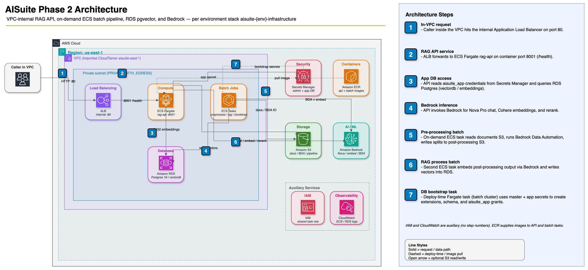
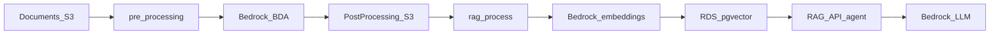

# AISuite RAG service

Application code for the CMCS Agentic RAG pipeline (Phase 2 packaging).

## Architecture

### Cloud layout

Each environment deploys an internal ALB and ECS Fargate RAG API, on-demand ECS
batch tasks (pre-processing, RAG process, DB bootstrap), and private RDS
Postgres with pgvector. S3, Secrets Manager, ECR, and Bedrock sit outside the
VPC but in the same account/region.



*Alt text: AWS reference architecture for AISuite Phase 2 VPC, ECS, RDS, S3, and Bedrock.*

Open or edit the diagram in [diagrams.net](https://app.diagrams.net/) by loading
`docs/aisuite-phase2-architecture.drawio.png` (PNG with embedded draw.io XML).
See also the [repo root README](../../README.md#architecture).

### Pipeline data-flow



1. **Pre-processing** lists source docs under the active contract’s S3 prefix,
   runs Bedrock Data Automation, and writes parsed text/table/image outputs to
   the post-processing bucket.
2. **RAG process** loads those outputs, chunks text, writes split JSON, embeds
   with Bedrock, and stores vectors in the active contract’s embeddings table.
3. **API** answers natural-language questions via search over that table and a
   Bedrock foundation model.

## Running the service

Work from this directory (`services/rag`) so Python packages resolve. Install
deps from `requirements.txt` first. There is no Docker Compose local stack;
local runs still need AWS access (S3, Bedrock) and a reachable Postgres
(pgvector), or Secrets Manager credentials for the private RDS (often via
VPN/bastion).

### Entry points

| Mode | Local command | Cloud |
|------|---------------|--------|
| Query API | `python -m search.routes.endpoint` (or Docker image `CMD` → uvicorn) | Always-on ECS Fargate service on port `8001` |
| Pre-process batch | `python -m data_preprocessing.pre_processing` | ECS on-demand task |
| Embeddings batch | `python -m data_embeddings_storage.rag_process` | ECS on-demand task |
| DB bootstrap | usually not local (needs master secret) | One-shot Fargate task: `python -m data_embeddings_storage.database.bootstrap` |

Typical ingest order after documents land in the input prefix:

```sh
python -m data_preprocessing.pre_processing
python -m data_embeddings_storage.rag_process
```

### Query API (local)

```sh
export API_HOST=0.0.0.0
export API_PORT=8001
# Optional: API_RELOAD=true
python -m search.routes.endpoint
```

| Endpoint | Purpose |
|----------|---------|
| `GET /health` | Health check |
| `GET /agent?query=…` | Agent answer (query string) |
| `POST /agent` | Agent answer; body `{"query": "…"}` |
| `GET/POST /query` | GraphQL |
| `GET /docs` | OpenAPI UI |

Example:

```sh
curl -s "http://127.0.0.1:8001/agent?query=What+is+coverage+for+NEMT%3F"
curl -s -X POST "http://127.0.0.1:8001/agent" \
  -H "Content-Type: application/json" \
  -d '{"query":"What is coverage for NEMT?"}'
```

### Cloud operation

- **API**: deployed via the AISuite stack (desired count gated by
  `aisuite:activateApi`). Traffic is internal ALB only.
- **Batch / bootstrap**: run the corresponding ECS task definitions on the
  private cluster/subnets. Stack outputs include bootstrap cluster name, task
  definition ARN, security group, and subnet IDs (`RunTask` contract).
- Bucket names and model IDs are injected via ECS environment variables (see
  below), which override matching keys in `aws.properties.ini`.

## Environment variables

Path, model, and table defaults live in
[`common/utils/aws.properties.ini`](common/utils/aws.properties.ini). Comments
at the top of that file list env → property mappings. `Helper` applies env
overrides first, then the active `[contract:…]` section, then `[default]`.

### Cloud (ECS-injected)

| Variable | Role |
|----------|------|
| `AWS_REGION` / `AWS_DEFAULT_REGION` | AWS region |
| `DOCUMENTS_BUCKET` | Source documents bucket |
| `POST_PROCESSING_BUCKET` | BDA / RAG post-processing bucket |
| `PIPELINE_TEMP_BUCKET` | Temp / summary logs bucket |
| `DB_SECRET_ARN` (or `DB_SECRET_NAME`) | Secrets Manager secret for app DB credentials |
| `BEDROCK_MODEL_ID` | Foundation LLM |
| `BEDROCK_EMBED_MODEL_ID` | Embedding model |
| `EMBEDDINGS_TABLE_NAME` | Optional override of active contract table name |

**Bootstrap task only** (from Secrets Manager at task start; never put in task
env plain text, workflow args, or logs):

| Variable | Role |
|----------|------|
| `PGHOST`, `PGPORT`, `PGUSER`, `PGDATABASE`, `PGPASSWORD` | Master DB connection |
| `APP_PASSWORD` | Password for `aisuite_app` |

### Local development

| Variable | Role |
|----------|------|
| Standard AWS credential chain | S3, Bedrock, Secrets Manager (no profile names required in docs) |
| `AIPropFile` | Path to an alternate properties INI (absolute or relative) |
| `db_host`, `db_name`, `db_user`, `db_password`, `db_port` | Direct Postgres; if all of host/name/user/password are set, Secrets Manager is skipped |
| `DB_SECRET_ARN` / `DB_SECRET_NAME` | Used when local `db_*` vars are not fully set |
| `API_HOST`, `API_PORT`, `API_RELOAD` | API bind (defaults `0.0.0.0`, `8001`, `false`) |
| Same bucket/model vars as cloud | Optional overrides over the shipped INI |

Optional tuning (INI fallback if unset): `embedding_dimension`,
`embedding_batch_size`, `db_pool_min`, `db_pool_max`.

Constraints: private RDS is not open to the public internet; Bedrock and S3
need valid account permissions for the non-prod (or prod) account you target.

## Specifying documents and contracts

There is **no per-file CLI** and no document-id filter on search.

### Ingest (batch)

Pre-processing lists **all** `.pdf` and `.docx` objects under
`input_bucket_name` + the active contract’s `input_prefix`.

To focus work on a particular file:

1. Upload that object under the contract prefix (or only that object present), **or**
2. Temporarily set `input_prefix` to a narrower key prefix that contains only
   what you want, **or**
3. Switch the active contract (see below) if the document belongs to another
   contract’s tree.

Then re-run pre-process → rag_process. Embeddings write to the active
contract’s `embeddings_table_name`.

### Search (API)

The agent accepts only a natural-language `query`. Results come from the active
contract embeddings table configured in the INI / `EMBEDDINGS_TABLE_NAME`.

## Per-contract configuration (dev)

Multi-contract isolation uses shared S3 buckets with per-contract prefixes and a
per-contract embeddings table on the same RDS instance.

| Role | Dev bucket |
|------|------------|
| Source documents (input) | `aisuite-dev-contract-rag` |
| BDA / RAG post-processing | `aisuite-dev-contract-rag-post-processing` |
| Pipeline code | `aisuite-dev-llm-pipeline-code` |
| Pipeline temp / summary logs | `aisuite-dev-llm-pipeline-temp` |

Contract-specific paths and `embeddings_table_name` live in `[contract:…]` sections of
`common/utils/aws.properties.ini`. ECS still overrides bucket names via env
(`DOCUMENTS_BUCKET`, `POST_PROCESSING_BUCKET`, `PIPELINE_TEMP_BUCKET`).

### Active contract

Exactly one section may have `active = true`. Default for dev is `tn_6756` (TennCare).
To switch:

1. Set `active = true` on the target `[contract:…]` section.
2. Set `active = false` on the previously active section.
3. Leave prefixes and `embeddings_table_name` alone unless rewiring storage.
4. Restart / redeploy tasks so they reload the INI.

### Contract matrix (dev)

| ID | Active | `input_prefix` | `embeddings_table_name` |
|----|--------|----------------|-------------------------|
| `me_0002` | false | `state_of_ME/MCR-ME-0002-NEMT/` | `embeddings_me_0002_nemt` |
| `tn_6756` | true | `state_of_TN/MCCRS-TN-6756-TennCare/` | `embeddings_tn_6756_tenncare` |
| `wa_6369` | false | `state_of_WA/MCCRS-WA-6369-IFC/` | `embeddings_wa_6369_ifc` |
| `wa_6472` | false | `state_of_WA/MCCRS-WA-6472-AHIMC/` | `embeddings_wa_6472_ahimc` |
| `wa_6473` | false | `state_of_WA/MCCRS-WA-6473-IFC/` | `embeddings_wa_6473_ifc` |

Full `output_prefix` / BDA / RAG folder paths are in the INI under each contract section.

### Bootstrap note

Bootstrap creates each contract’s embeddings table (and indexes) so switching `active`
does not require a re-run for DDL. Search/store use only the active contract table.

## One-time DB bootstrap (app user)

CDK manages an on-demand Fargate task that bootstraps the private RDS database.
It reuses the batch ECS cluster, ECR repository, immutable batch image tag,
private subnets, and application security group. It is a one-shot task
definition, not an ECS service.

Run the task after the initial infrastructure deploy and after pushing the
corresponding batch image. The stack outputs `BootstrapClusterName`,
`BootstrapTaskDefinitionArn`, `BootstrapSecurityGroupId`, and
`BootstrapSubnetIds` as the `RunTask` contract. Deployment workflow automation
is handled separately.

ECS injects `PGHOST`, `PGPORT`, `PGUSER`, `PGDATABASE`, and `PGPASSWORD` from
the master database secret and `APP_PASSWORD` from the app database secret.
The values are resolved by the ECS execution role at task startup; they must
not be supplied through task-definition environment values, workflow
arguments, or logs.

The bootstrap entrypoint is
`data_embeddings_storage.database.bootstrap`. It runs idempotently and:

- creates the `vector` and `pg_trgm` extensions;
- creates the dedicated `aisuite_schema` (not `public`) for application objects;
- migrates any legacy `public.embeddings*` tables into `aisuite_schema`;
- creates each contract’s embeddings table (from `aws.properties.ini`) and HNSW,
  metadata GIN, trigram GIN, and full-text GIN indexes matching `table_setup.py`;
- creates `aisuite_app` or safely updates its password from the app secret;
- creates the shared `aisuite_app_owner` NOLOGIN group role, grants it to
  both rotation logins, and reassigns `aisuite_schema` (tables and sequences)
  to that owner so index DDL succeeds under either Secrets Manager login;
- grants `CONNECT` on the database and schema/table privileges on
  `aisuite_schema` to `aisuite_app` and `aisuite_app_clone` (Secrets Manager
  multi-user rotation), including `CREATE` on the app schema for idempotent
  table setup;
- sets each app role’s `search_path` to `aisuite_schema, public`; and
- grants default table DML and sequence usage/select privileges in
  `aisuite_schema` for objects created by the bootstrap master role.

Runtime connections set `search_path` on pool init so unqualified table names
resolve to `aisuite_schema` regardless of which rotation login is active.
A fresh environment needs bootstrap (or the master SQL remediation below)
before the app path can create indexes.

### Operator remediation (VPN + CLI)

```sh
export AWS_PROFILE=aisuite-dev
./scripts/psql-rag.sh --master -v ON_ERROR_STOP=1 -f scripts/sql/init-aisuite-schema.sql
./scripts/psql-rag.sh --probe
```

`init-aisuite-schema.sql` creates the schema, migrates leftover
`public.embeddings*`, installs `aisuite_app_owner`, reassigns object
ownership, and grants both app roles (not full table DDL).

After bootstrap, applications use
`aisuite/{env}/rag-app-db-credentials`, not the master
`rag-db-credentials` secret. Schema DDL remains a privileged bootstrap
responsibility.
